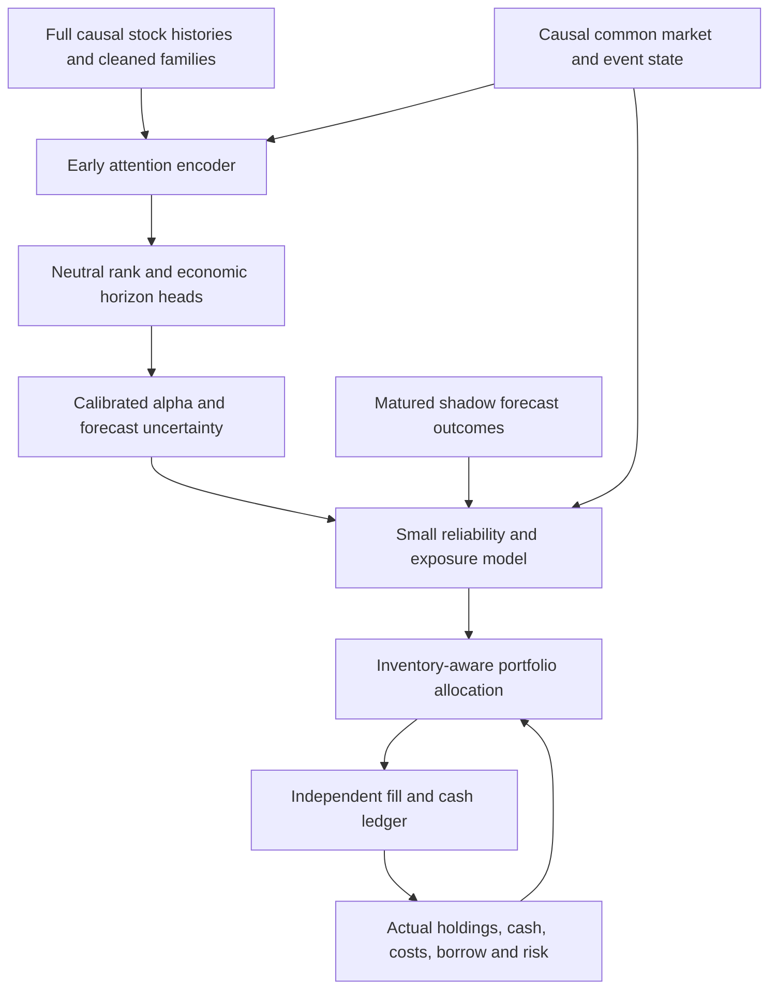

# Brazil-RV: decision-model postmortem and remaining research

Review date: 2026-09-14. Implementation reviewed: `553e9aff28190d4579ddda09683c49411d142199`.

This document answers the user's six questions after the completed cash-aware portfolio experiment. It revisits the original post-data A–F plan and subsequent execution plans. It distinguishes demonstrated mechanisms, observed financial outcomes and untested hypotheses. It is a research review, not a new experiment registration or model promotion.

**The result does not justify abandoning learned portfolio construction. I found a consequential stock/hedge calibration mismatch, an inadequate interface for learning when the overall forecast is weak, and a material finite-sample problem in the reported confidence intervals. The remaining target/objective experiments are also still needed.** These findings do not establish that fixing them will beat the existing comparator; that requires a controlled follow-up.

The review reads 270 saved base-scenario books, their 222 distinct account files and 126 policy manifests, verifying all 618 archive members against the sealed inventory. It adds a synthetic allocation mechanism demonstration and descriptive uncertainty sensitivities. No historical strategy was refitted or replayed, no raw data changed, and no GPU instance was launched. Original financial results remain intact.

## 1. What happened in the disastrous attention half-year?

The anticipated improvement partly happened. The original attention F2 / 2018 H2 legacy result was −7.892 bps/day from an empty book. Under the newer comparison's common burn-in it is −7.211. These are different starting-state conventions, not a revised measurement of the same book.

The following uses **only the common-burn-in convention**, net of modeled costs, borrow and financing, above the same CDI cash benchmark:

| Attention period | Legacy | Calibrated optimizer | Learned policy, mean of three seed outcomes |
| --- | ---: | ---: | ---: |
| F2 / 2018 H2 | −7.211 | +3.542 | −0.285 |
| F6 / 2020 H2 | +3.178 | −2.784 | −1.075 |
| F10 / 2022 H2 | −0.522 | +1.239 | +1.342 |
| F14 / 2024 H2 | +9.038 | +6.516 | +6.299 |
| All fourteen development folds | +3.904 | +2.610 | +2.162 |

In F2 the optimizer improves **10.752 bps/day**, and the learned policy improves **6.926**, relative to its own legacy reference. Gains in one half-year are offset by losses of opportunity or worse decisions elsewhere. The mean of seed outcomes is descriptive; it is not an implemented ensemble of portfolio policies.

However, **this was not successful learning to sit in cash during F2**. Mean realized joint gross increases from 212.45% for legacy to 223.58% for the optimizer and 223.63% for the learned policy. The optimizer and all three learned seeds target maximum joint gross and maximum BOVA short on every discretionary evaluation day in this fold. The recorded 99.18% fraction includes one mandatory final liquidation day.

The F2 optimizer changes stock gross P&L from −4.800 to +15.241 bps/day, while hedge gross changes from −0.757 to −9.656. That hedge loss is attached to a substantially different equity book. Subtracting it would not reconstruct an unhedged strategy with equivalent risk and financing. The learned mean's corresponding components are +11.295 and −9.714.

Thus two statements can both be true: the legacy action map wasted value in F2, and the tested replacement did not learn a reliable exposure policy across periods. Moreover, we have not established that F2's eventual losses were predictable at each earlier decision. Avoidance based on the completed half-year is hindsight; the relevant question is whether observable state predicted lower *subsequent* net opportunity.

Sources: [saved-book and allocation evidence](v2_portfolio_decision_audit_evidence.json), [original attribution](v2_EXECUTION_REASSESSMENT.md), [complete experiment results](v2_PORTFOLIO_POLICY_REVIEW.md).

## 2. Most consequential finding: stock and hedge preferences use inconsistent return baselines

### Implementation and actual exposure

`fit_calibration` regresses five-session **raw shareholder return minus CDI**, divided by five, on three standardized forecast ranks. It includes a pooled intercept. `PreferenceModel` adds that intercept to every stock. `decide` then assigns BOVA **zero** expected excess return. This is implemented as registered; it is a modeling mismatch, not a solver silently violating its specification.

The intercept is identical across forecast families because it is the same date-weighted average economic outcome on their common population. It ranges from **3.340 to 8.177 bps/day** across folds. F2 uses **8.053**; F6 uses **7.091**. It is an unconditional expanding-history estimate, not evidence that the model expects strong opportunity today.

Writing stock preferences as `mu_i = c + a_i`, the objective contains `c * sum(stock weights)`. Dollar neutrality constrains stock weights **plus hedge weight**. Consequently, a long-stock/short-BOVA position can earn a large *assumed* return from `c`, even though no corresponding expected common-market return is assigned to the hedge. A tight total-net limit does not remove this incentive.

The saved continuous allocations show the mechanism is economically relevant:

| Optimizer family | Mean stock net | Mean BOVA weight | Dates targeting BOVA short cap | Dates targeting joint gross cap |
| --- | ---: | ---: | ---: | ---: |
| S0 | +65.04% | −59.90% | 94.30% | 94.48% |
| TE_all | +65.12% | −59.95% | **99.71%** | 87.28% |
| C6 | +65.07% | −59.92% | 96.72% | 67.38% |

Exposure means are end-of-day realized positions. Cap fractions are pre-fill targets and include the final liquidation day. They are distinct quantities. The learned models often retain a similar tilt; they do not reliably undo the initialization.

### Controlled mechanism demonstration

I ran the actual allocator on sixty identical synthetic stocks, all beta one, with 2% daily idiosyncratic volatility, 1.5% market volatility, nonzero borrow and the existing cost/risk/cap settings. There is **no stock-selection information**.

| Expected-return specification | Chosen gross | Stock net | BOVA |
| --- | ---: | ---: | ---: |
| Zero excess return for every asset | Approximately 0% | 0% | 0% |
| +8 bps/day for all stocks, zero for BOVA | **125%** | +65% | −60% |
| Same +8 bps/day for stocks and BOVA | 5% | Approximately 0% | Approximately +5% |

With exact zero net/beta, the stock-only intercept still produces **120% gross**; the common-return case produces cash. This isolates the mechanism without using future financial outcomes. It does **not** estimate the historical performance of removing the intercept.

### Recommended resolution

Use a coherent return decomposition. One useful specification is:

`stock expected excess return = stock residual alpha + causal beta * expected market excess return`

`BOVA expected excess return = expected market excess return`

For a relative-value controller without a market-direction forecast, calibrate stock residual outcomes against the same hedge benchmark and set the shared market forecast to zero. The beta used to construct that residual label must be the estimate available at the decision, not a beta fitted to its future return window. Actual shareholder actions, cash claims and CDI remain in economic accounting.

A shared residual premium of our eligible universe relative to BOVA might exist. Do not assume it is zero by definition or blindly erase it. Estimate it separately with appropriate shrinkage and chronological evidence, rather than inheriting the entire raw-stock historical mean as stock-specific alpha. Likewise, adding the identical intercept to BOVA is only a diagnostic in the beta-one toy, not the full correction for heterogeneous stock betas.

Run three frozen-forecast diagnostics first: existing calibration; stock-intercept suppression as an attribution control; coherent stock/benchmark calibration. Keep the same risks, costs, feasible set and scores. Compare exposure, alpha dispersion, hedge usage and net utility. The required historical counterfactual has **not** been run here.

Code: [calibration](../research/src/brazil_rv/v2/portfolio_inputs.py), [preference model and hedge](../research/src/brazil_rv/execution/portfolio_policy.py), [allocation objective](../research/src/brazil_rv/execution/allocation.py).

## 3. The controller was not given a complete forecast-quality problem

The architecture is a shared two-layer, 32-wide MLP with 1,857 parameters, adding a residual preference to the calibrated optimizer. It sees thirteen static inputs and ten inventory/account inputs:

- D3/D5/D10 ranks and one-session rank changes; current/prior validity.
- Own volatility, beta, borrow and prior published CDI/validity.
- Own weight, holding age, marked P&L, pending exit/entry information and held flag.
- Common free/restricted cash, gross, net and estimated beta.

It can condition on volatility and inventory, so it is inaccurate to say it has no risk or market information. But it receives **no direct common macro/event representation, no recent realized forecast-quality state, no explicit cross-seed disagreement, no forecast-error uncertainty and no learned pooling of the day's opportunities**. The shared stock MLP's account variables are mostly consequences of prior decisions, not a sufficient description of external opportunity.

The cache first ranks each forecast seed, averages those ranks, and normalizes the result. This retains agreement indirectly through the averaged rank, but loses the individual seeds and their disagreement. It also discards cross-date score levels/spreads. Crucially, those discarded raw scores were trained with a standardized rank loss: they are **not automatically calibrated confidence measures**. Simply replacing ranks with raw logits would exchange one problem for another.

A rank model will still identify a top and a bottom group when the whole day's signal is weak. The unconditional rank-to-return calibration can then keep assigning economic value to those extremes. A cash action alone does not teach the model how much faith to place in them.

Add a small, explicit reliability/exposure path with inputs that can answer that question:

1. Separate per-head forecasts and cross-seed agreement, calibrated on chronological out-of-fit predictions. Disagreement is a candidate feature, not a validated posterior variance.
2. A small pooled summary of the current alpha opportunity distribution and estimated forecast uncertainty, together with the already available causal market state. Compute common inputs once per date.
3. Recent realized performance/calibration of a **fixed shadow forecast or reference portfolio**, with exact publication/return maturity. This continues updating while the actual policy holds cash, avoiding a blind state when trading stops. For an H-session forecast originating at t, its full outcome must not enter the state before its endpoint is known.
4. Existing own-inventory state for keeping, resizing or exiting a position. Add a path feature only if it contains information absent from the forecast/history; entry P&L is not a sufficient summary of changing fundamentals or macro conditions.

A reliability head that rescales residual alpha before constrained allocation is a useful first design. Its zero-opportunity setting should express a cost-aware move toward cash, with real liquidation costs and pending inventory respected. It need not hard-liquidate on every weak observation. Keep a small stateful residual controller as the more flexible comparator.

## 4. Risk aversion is not forecast uncertainty; our feasible-set comparison also confounds attribution

The current QP penalizes return variance using a market factor plus diagonal residual covariance. It does **not** model uncertainty in expected alpha. If a noisy estimate confidently says a stock will earn 8 bps/day, ordinary mean–variance optimization can rationally deploy to its constraints. Lowering a gross cap would disguise the issue; correcting the expected-return model and its uncertainty is preferable.

A canonical extension is shrinkage or a calibrated forecast-error penalty. For example, an uncertainty set on means yields a term proportional to `sum(uncertainty_i * abs(weight_i))`; a correlated uncertainty model can penalize uncertain common exposures rather than every stock equally. The uncertainty scale must be estimated on past out-of-fit errors, not tuned to make F2 cash. Return volatility, estimation uncertainty and transaction costs are different quantities; do not stack arbitrary penalties for all three. [Boyd et al., section 4.3](https://web.stanford.edu/~boyd/papers/pdf/cvx_portfolio.pdf) explicitly distinguishes forecast-error risk from return covariance.

Our covariance also assumes residual independence after one market factor. Brazil can have important sector, issuer/share-class and other common residual exposures. This is a plausible reason that a large offsetting stock/ETF book looks safer to the optimizer than it really is. Measure exposure and realized risk calibration first; add a compact causal factor structure if supported. Do not respond by neutralizing every conceivable factor or discarding related data.

The legacy/new comparison changed several things simultaneously: quotas, sizing, retention, stock/hedge joint construction, a ±5% planned total-net band versus legacy's wider band, and how the joint gross ceiling is used. It is a valid comparison of complete policy packages. It does **not** isolate a benefit or cost of ML. The learned-versus-calibrated-optimizer comparison is better matched, but both inherit the calibration and risk assumptions.

An attribution bridge should use common constraints to compare deterministic sizing/retention alternatives and should include a stock-only beta-neutral optimizer with the hedge disabled as a diagnostic. Preserve the historical legacy book as a reference. Do not infer from BOVA losses alone that hedging should be abolished: equity alpha, hedge risk, borrowing and financing have to be assessed jointly.

Cash correctly earns historical CDI, and every reported net-excess result subtracts that same cash benchmark. The invested account also receives its modeled financing income, including fully remunerated restricted short proceeds in the base scenario. Moving to cash does not unlock an extra CDI return that can simply be added to the published excess P&L. Its benefit is avoiding uncompensated exposure and costs; short-proceeds remuneration and debit terms remain explicit assumptions.

## 5. What learning and stopping did—and did not—establish

The direct sequential technique is defensible for this setting. Market returns are treated as exogenous to our small simulated book; account transitions are explicit; gradients pass through allocation and subsequent inventory. This avoids the need for a separate value network. A critic is one possible tool for harder control problems, not a requirement for this offline differentiable formulation. Conversely, not using a critic does not make the experiment immune to overfitting or gradient limitations. [Differentiable convex layers](https://arxiv.org/abs/1910.12430) supports the mechanism, not a financial success guarantee.

The numerical acceptance was meaningful: independent-account reconciliation, native-QP finite differences, sequential gradients, and a 32-versus-64-session gradient comparison. But these tests do **not** demonstrate that the actual recipe learns reliable de-risking on unseen regimes. The present training test checks completion, finite values, selection and reuse; it does not require outperforming a known policy on independent simulated dates where a causal regime indicator reveals when to hold cash.

| Family | Fits selecting epoch zero | Mean selected-minus-initial selection utility | Selected utility below cash |
| --- | ---: | ---: | ---: |
| S0 | 14 / 42 | +5.412 bps/day | 10 / 42 |
| TE_all | 17 / 42 | +3.392 bps/day | 13 / 42 |
| C6 | 17 / 42 | +4.127 bps/day | 6 / 42 |

The selection gains are optimistic by construction: the best visited checkpoint is chosen on that window. Their failure to transfer to evaluation is evidence of selection/generalization difficulty. It is inaccurate to say learning never helps selection. Median terminal-minus-initial selection utility is negative for all three families, while median first-to-last *online training* utility rises. That training statistic mixes parameter states as Adam updates; it is not a clean frozen-checkpoint training backtest.

Only 286 policy-training dates precede F1 and 409 precede F2; even F14 uses 1,897 dates. Many stocks per day help learn shared cross-sectional effects, but they do not supply hundreds of independent observations of a common market regime. The 55-session selection window is short for choosing a sequential portfolio policy across up to 30 epochs.

Epoch zero means **the calibrated optimizer**, not cash. Cash was an external comparator, not a selectable checkpoint/fallback. Thus a trained candidate with negative selection utility can still be the selected model. A cash/optimizer/learned fallback selected only from prior data is an inexpensive control, but a noisy last-55-day rule is not automatically optimal and would not explain all failures: all three TE F2 selected utilities were positive, yet two subsequent F2 outcomes were negative.

I would next test a low-dimensional economic calibrator/reliability head before another unconstrained MLP fit. Calibrate residual amplitude and learning rate, and use shrinkage toward the coherent baseline. Inspect update size, realized turnover, action changes and exposure response. The MLP's lack of weight decay/dropout is not proof of healthy regularization; nor does adding SAM automatically fix noisy sequential credit assignment. An expensive SAM/ASAM controller sweep is not the first response.

Also audit saturation. In F2 the BOVA and gross constraints are binding at almost every discretionary decision. Gradients through a correctly solved constrained problem can be locally uninformative for moving a saturated common exposure: a material change in preference may be needed before the active constraint changes. Nonzero global gradients do not establish that the *cash/exposure direction* learns. The demonstrated calibration mismatch makes this worth testing directly.

## 6. Horizon, transaction costs and losing positions remain incompletely modeled

The allocator multiplies daily preference, risk and borrow by five, charges immediate transaction costs once, and replans every day. All three forecast horizons enter a regression to **one five-session payoff**. This learns a linear combination of horizons; it does not learn a coherent return-decay curve or plan a sequence of future trades.

Training itself includes realized daily costs and state, so it is not simply forgetting turnover. Nevertheless, the constrained layer provides a static approximation to the problem the learner is trying to solve. The MLP must compensate for a single fixed effective horizon, shifting alpha and future adjustment costs through its preferences. Cost increases in some learned books are substantial: C6 F6 pays **4.30–5.12 bps/day** in trading costs across seeds versus **1.39** for its optimizer. That is a symptom to diagnose, not a reason to lower the recorded cost assumption.

The appropriate next extension is modest receding-horizon control: calibrate a consistent horizon/decay representation, plan a small number of future allocations using forecasts, and execute only the first. No future realized return enters the plan. Overlapping D3/D5/D10 cumulative outcomes must not be summed as independent gains; any interval conversion must respect the return and cash-flow conventions. [Gârleanu and Pedersen](https://w4.stern.nyu.edu/facdir/lpederse/papers/DynamicTrading.pdf) shows why predictor decay affects optimal trading under its assumptions; [Boyd et al.](https://web.stanford.edu/~boyd/papers/cvx_portfolio.html) supplies a practical planning framework. Neither establishes that a longer planning horizon will improve our book.

A losing position should be reduced when its conditional future opportunity no longer pays for risk and the cost of retaining/replacing it, or when a genuine risk limit requires it. Past loss alone does not prove that future expected return is negative. The existing state permits loss-dependent behavior, but no controlled result establishes that it learned good stops. Include a small predeclared daily stop/retention rule as a diagnostic control if useful; do not optimize dozens of thresholds on the known five F2 losers.

At our current decision frequency, an adverse move becomes actionable at the next daily decision. An intraday stop at its trigger price cannot be validated with this close-proxy ledger. Future intraday intervention remains compatible with a slow forecast and a faster risk/controller update, but it is separate work and does not require reviving intraday alpha or forward capture now.

## 7. A material statistical correction: the original intervals are not robust

The original readout uses finite, non-circular 20-session blocks inside each roughly half-year fold, then takes percentile intervals directly. Boundary observations receive much less expected sampling weight than interior observations. For these books, boundaries include distinct liquidation, settlement and initial-state effects. The resulting bootstrap distribution is materially displaced from the statistic being reported.

This is not a claim that moving-block bootstrap is always invalid. It is a measured finite-sample inference problem for these short, nonstationary book segments:

| Learned mean minus optimizer utility | Observed difference | Exact expected mean under original block sampler | Original nominal 95% interval | Circular 20-session sensitivity |
| --- | ---: | ---: | ---: | ---: |
| S0 | −1.320 | **−2.530** | [−4.883, −0.112] | [−3.870, +1.269] |
| TE_all | −0.678 | **−1.872** | [−3.661, −0.055] | [−2.645, +1.302] |
| C6 | −1.542 | **−2.258** | [−4.066, −0.398] | [−3.469, +0.363] |

The sampler's exact expected means are calculated from its possible block starts, not Monte Carlo guesses. Circular resampling balances each day's expected inclusion; it also introduces an artificial wrap at each fold boundary, so it is a **sensitivity**, not a retroactively declared superior confirmatory test. Forty-session sensitivities include zero for all families. At sixty sessions C6's within-fold upper endpoint is approximately −.011, illustrating method sensitivity rather than a robust rejection.

For the actual continuous portfolios, a forty-session circular paired sensitivity gives learned-minus-optimizer utility:

- S0: −1.380 bps/day, interval [−4.594, +1.436].
- TE_all: −0.913, interval [−3.236, +1.294].
- C6: −1.778, interval [−4.131, +0.317].

All are nominal, post-hoc development calculations. They do not adjust for repeated model/recipe research. A longer block is not automatically more reliable, especially inside short folds. Next protocol: make the continuous book primary, fix a dependence-aware resampling method and block sensitivities in advance, check resampling centering/inclusion, and show fold/seed effects separately. Audit other reports using the same interval helper before relying on their significance claims.

**Correct conclusion:** the learned models have worse average outcomes in the tested comparisons and do not pass the advancement rule; the previously suggested confidence that learning is inferior is weaker than the original intervals imply. This changes interpretation, not recorded P&L, and does not turn the failed advancement gate into a pass.

## 8. Prediction target, loss, selection and portfolio reward are still different tasks

The current chain is:

| Layer | Actual contract | Information/objective consequence |
| --- | --- | --- |
| Economic label construction | Future shareholder returns with action handling and exact endpoint masks | Preserves economic outcomes; these arrays are available |
| Forecaster target | Median centering, lagged-volatility scaling, clipping, volatility/beta/liquidity residualization, then ranks | Removes magnitude and some economically predictable common/style variation |
| Forecaster loss | Per-date/head soft-Spearman surrogate with standardized predicted scores | Encourages cross-sectional order; does not identify expected returns or forecast reliability |
| Forecaster checkpoint selection | Average D3/D5/D10 neutral-target IC on a shared population | Rewards broad ranking quality, not net contribution of feasible trades |
| Portfolio calibration | Three rank regressors to raw five-session excess return, with pooled intercept | Attempts to reconstruct economics from a compressed proxy; inherits stock/hedge inconsistency |
| Portfolio control | Fixed-five-session expected preference/risk/cost optimization | Static planning approximation |
| Learned-policy objective/selection | Sequential net CDI-excess minus fixed prior variance penalty; exact-ledger selection | Much closer to economics, but cannot recover information never exposed in forecasts/state |

The loss is **not cross-entropy**. It is a differentiable rank-correlation objective. The older B8 Pearson-on-ranks trial did not test magnitude-aware return learning or remove target neutralization.

The already measured illustration is strong: on the original A–C screen, TE_all improves neutral IC from S0's .01885 to .02710, but raw shareholder-return IC is essentially unchanged (.04677 versus .04672). This does not prove the target is wrong; it shows the improved task was not the same as raw economic prediction.

Portfolio-level beta/net control already serves the user's neutrality requirement. That does not require label-level removal of ten volatility groups, five beta groups and liquidity exposure. The extra label restrictions may be useful inductive biases, but their economic cost has not been isolated. Removing all of them at once would be an uncontrolled experiment.

### Recommended objective sequence

1. **Economic mapping on frozen forecasts.** Correct stock/hedge calibration, measure tail calibration, horizon decay, uncertainty and feasible-trade utility. This is the fastest experiment and needs no encoder pretraining.
2. **Magnitude-preserving auxiliary head.** Keep the functioning neutral-rank objective, and add a return-unit objective on raw CDI-excess or explicitly benchmark-residual shareholder outcomes. Compare these as declared variants. Use causal volatility scaling for numerical conditioning with an explicit inverse conversion to economic units; do not permanently discard magnitude or hard-clip away losses merely to stabilize training.
3. **Joint selection diagnostics.** Evaluate rank IC, cardinal calibration and net utility under one frozen policy contract. Choose the checkpoint rule on selection data before evaluation. Economic selection is noisy too: replace a sole IC rule with a declared economic/forecast criterion and stability evidence, not unrestricted maximization of a 55-day Sharpe.
4. **Optional decision-focused fine-tuning.** Once the allocation contract is coherent, allow gradients from the portfolio objective into a small economic head, then into the encoder if warranted. Retain a supervised auxiliary signal and matched controls to limit adaptation to ledger artifacts.

A robust regression loss can help optimization, but Huber loss need not estimate the exact conditional mean in an asymmetric heavy-tailed distribution. Specify which statistical quantity the head predicts and check out-of-fit calibration in return units. Likewise, tail-weighted ranking is a legitimate later hypothesis, not a substitute for economic calibration and not a license to train only on the winners/losers chosen in hindsight.

Decision-focused learning addresses the fact that equally sized prediction errors can have different decision consequences. [Elmachtoub and Grigas](https://arxiv.org/abs/1710.08005) demonstrates this for predict-then-optimize problems, including portfolio examples. Its surrogate/theory is not a drop-in guarantee for our sequential, stateful, partly nonsmooth accounting problem.

**Revision to the previous recommendation:** I would no longer defer the economic auxiliary objective merely because this particular frozen-score MLP failed. If the predictor omits economically important magnitude or regime information, requiring a downstream controller to succeed first creates a circular gate. Correct the inexpensive controller defects first; then test the objective on one stable architecture without waiting for an unbounded policy search.

## 9. Prediction versus decision: recommended system

Keep a modular system that **can be trained jointly**, rather than choosing between permanently independent components and one opaque monolith:



The portfolio layer should learn what data can support: conditional forecast calibration, reliability, horizon use and inventory-dependent preferences. Mathematical accounting, available instruments, costs and explicit risk limits should remain transparent. A hand-written optimizer is a structured decision rule, not an admission that ML failed. A small learned component can meaningfully improve it without learning bookkeeping from samples.

This direction remains consistent with the practical treatment in [Boyd et al., *Markowitz Portfolio Construction at Seventy* (2024)](https://web.stanford.edu/~boyd/papers/markowitz.html): modern constraints, costs and forecast uncertainty can be addressed inside an efficient convex formulation. That supports the structured allocation component; it does not establish which alpha model, uncertainty estimator or risk budget works best for Brazil-RV.

For frozen-forecast policy training, use chronological out-of-fit predictions; the existing cache is useful. For later end-to-end training, the predictor and controller may jointly fit the same permitted training outcomes, provided selection/evaluation are later and the entire system is treated as one fitted model. That is a different protocol, not a reason to misuse in-sample predictor outputs as supposedly out-of-fit policy data.

My preferred next controller comparison is coherent deterministic allocation versus a small reliability/calibration model versus the existing stateful residual model with corrected inputs. Keep cash and one simple cost-aware retention/exposure control. Do not begin with PPO, an actor–critic, a new large recurrent execution network, or a library of optimized stop rules. More complicated control becomes justified if partial observability, long credit horizons or endogenous execution effects prove material.

This is primarily **portfolio construction and position management**, not order scheduling. The future intraday execution/risk mechanism can use the same state/action contract without forcing the slow alpha encoder to forecast every minute.

## 10. Original A–F plan: status and disposition

Reference: [v2_POST_DATA_RESEARCH_PLAN.md](v2_POST_DATA_RESEARCH_PLAN.md). The later [A–C report](v2_POST_DATA_ABC.md) remains the detailed acceptance record.

| Stage / proposal | Current status | What remains applicable |
| --- | --- | --- |
| A: repaired data binding, selection-aware training, bias routing, ASAM, initialization, provenance and diagnostics | Implemented | Preserve; do not reopen source repairs without contrary evidence |
| B: bounded optimization/relational calibration | Implemented for forecasters | Add an analogous independent-date controller learning acceptance, not just numerical tests |
| C: fresh baseline, GRU/reference, slow early/late attention, family and FiLM separation; .2/.5 ASAM extension | Completed screen | Retain results and all attempts; no need to repeat the entire roster |
| D: matched selected-P versus fresh-start versus slow-core transfer | **Not isolated on the current accepted rich candidate** | Still valid. The repaired C6 bridge tests a useful roster/inherited-parent package; it is not this matched transfer ablation |
| D: additive/residual learning around a strong forecast | **Open** | High-value small alternative. C6/TE blending and a simple cross-fitted residual model can test complementarity before new encoders |
| D: low-rank/additive context fusion | **Open** | Conditional on evidence that context/family fusion is brittle; preserve all meaningful input fields |
| D: consistency, GSAM, recency/coverage variants | **Deferred, conditional** | No automatic sweep. Diagnose stability/drift before choosing one |
| E: broader development confirmation and economics | **Substantially completed for selected survivors** | S0, TE_all .2, repaired C6 and rich TL now cover fourteen folds. Not every original C cell was confirmed, and none of this is a new untouched holdout |
| E: dependence-aware uncertainty and seed/omission robustness | Partly completed; this review adds boundary/longer-block sensitivities | Correct future inference protocol and audit affected historical significance claims |
| F: release-aware market/event histories and market-to-stock attention | **Open** | Current-state FiLM cannot reconstruct missing trajectories. Start with one compact causal history experiment |
| F: magnitude/neutrality/loss experiments | **Open and now high priority** | Economic auxiliary target plus matched objective ablation after inexpensive calibration corrections |
| F: encoder/readout capacity allocation | **Open, conditional** | Investigate a bottleneck with diagnostics; do not simultaneously enlarge the whole model |

Other still-applicable original-plan points: conditional family utility rather than univariate relevance; matched seed budgets; explicit transferred/new parameter treatment; simple controls; nonstationarity and effective date count; composite/head/traded-population alignment; and no automatic requirement that fit/validation IC gaps approach zero. Repaired data is not an assertion that every free-source historical observation is perfect.

The S0_common F2 seed11 run reached its 60-epoch ceiling while its patience was incomplete. That is a declared limitation of that control, not evidence that all current models underfit. Revisit only if S0_common is selected as the comparator for a new question. Do not restart every completed fit.

## 11. Later plans: completed work and omissions

Reference: [execution reassessment](v2_EXECUTION_REASSESSMENT.md), [portfolio registration](../research/preregistrations/v2_portfolio_policy.md), [implementation resolutions](../research/preregistrations/v2_portfolio_policy_implementation.md), and the two [attention screen](../research/preregistrations/v2_portfolio_attention_followup.md) / [confirmation](../research/preregistrations/v2_portfolio_attention_confirmation.md) registrations.

| Commitment / proposed experiment | Status | Next treatment |
| --- | --- | --- |
| Original-book decomposition and fixed-C6 accounting bridge | Completed | Use as attribution; do not compare unmatched book conventions |
| Repaired-data C6 roster/inherited-parent reproduction | Completed | C6 remains the strongest economic point-estimate comparator |
| Causal forecast prelude and all-fold caches | Completed | Reuse for cheap policy/calibration research; preserve source binding and purges |
| Differentiable account/QP implementation and exact replay | Completed | Retain; add behavior-learning acceptance and objective/constraint attribution |
| Cash, optimizer and learned-controller comparison | Completed **as registered** | Failure of this specification does not close the broader research question |
| Continuous model-switch books, cost/funding stresses | Completed | Keep continuous primary; funding assumptions still need real-world validation before deployment claims |
| Rich early/late attention | Screen and remaining-fold confirmation completed | No further timing campaign needed now |
| Raw-return/neutral auxiliary objective | Not implemented | Move into the next focused research program |
| Joint encoder-policy training | Not implemented | Conditional later comparison after a coherent economic interface, not an obligatory immediate rewrite |
| Learned opportunity/uncertainty state, explicit decay and multi-period planning | Limited implementation only | Rank combination and account state exist; the fuller proposal was not tested |
| Neutrality/stock-only versus joint-hedge attribution | Not isolated | Small deterministic bridge before ML conclusions |
| Capital-size/participation/impact calibration | Not completed | Needed for capacity/executability claims; no new arbitrary universe exclusion |
| Historical missing-print settlement resolution | Sensitivities and account reconciliation completed; source uncertainty remains | Investigate influential events using existing historical sources; a stale-mark settlement is not an observed fill |
| Intraday intervention and execution | Deliberately deferred | Keep deferred; no forward capture |

The full campaign completed its frozen registration. The broader list of research ideas did not thereby become complete. No requirement existed to run every conditional proposal regardless of evidence.

## 12. Should early rich attention become the default?

**Use TE_all .2 as the working attention candidate for the next objective/controller research, while keeping C6 and S0 as economic/reference controls. Do not declare it the universally best model.** Both TE_all and TL_all are rich-input attention models; the distinction here is peer mixing before versus after temporal pooling.

The all-fourteen-fold neutral IC is .026517 for TE and .024791 for TL. Late minus early net P&L is +.194 bps/day under legacy, but −.672 under the calibrated optimizer and −.695 in its continuous replay. Late's individual-seed legacy differences reverse sign (approximately −.597, +1.804, −.987). There is no robust late advantage.

Choosing early for continued research is supported by the user's desire to preserve history until peer interaction and by its stronger economic-optimizer/IC point estimates. It is not a promotion based on proven superior profitability. C6's all-fold neutral IC is .029321 and legacy net is +5.756 bps/day, versus TE's +3.904. Broadly, no single architecture has earned authority over every objective and policy.

Source: [complete early/late confirmation](v2_PORTFOLIO_POLICY_REVIEW.md#completed-rich-earlylate-attention-comparison). Its nominal intervals also inherit the earlier sampling caveat; the mixed signs and point estimates are unaffected.

## 13. Recommended next program: small questions in an efficient order

### Phase 1: repair the economic interface using frozen forecasts

Register a small roster around the demonstrated issue: existing calibration; intercept-only diagnostic; coherent benchmark-residual calibration; then one uncertainty/shrinkage variant. Include cash and a constraint-matched deterministic retention/sizing control. Keep encoder scores, identities, eligibility, fill assumptions and declared risk budget fixed. Inspect fitted intercepts/slopes, score correlations, tail calibration, gross/hedge saturation, expected versus realized opportunity, turnover and exposure-adjusted outcomes.

A ridge coefficient of .001 on highly correlated D3/D5/D10 ranks is one choice, not a calibrated optimum. Saved coefficients frequently have large opposing signs. Measure condition number and out-of-fit slope stability before deciding whether this is harmful collinearity or useful horizon-difference information. Do not force all coefficients positive without evidence.

This phase needs CPU allocation/replay and already recovered scores. Reconstruct a cache only once if necessary; the full derived cache is on persistent storage while source forecasts are recovered locally. No new full predictor training is inherently required. Time should be estimated from a representative complete replay, not from the prior GPU campaign.

### Phase 2: prove that the chosen controller can learn the intended behavior

Use independent synthetic training/evaluation dates with known conditional opportunity: useful signal, explicitly signaled zero-alpha periods, adverse-price paths with either continuation or reversal, changing borrow/costs, and genuine holding costs. Test profitable trading, cost-aware inactivity and differentiated exits. The zero-alpha state must not be inferred from future labels. Include the actual optimizer, state transitions and training recipe.

Then compare a small reliability/calibration model and the corrected stateful MLP on real chronological cached forecasts. Include a causal cash/optimizer fallback control. Do not label mathematical gradient flow or fitting a single path as successful learning. Do not expand seeds automatically; keep the three matched seeds and report reversals.

### Phase 3: align the forecaster objective, retaining early attention

On TE_all and one strong control, test neutral-only versus a specified economic auxiliary objective. If the parent objective/head changes, create or explicitly adapt a compatible parent; do not pretend changed-parent comparisons are identical reuse. Measure rank and cardinal calibration, tail outcomes and net utility under the repaired fixed controller. This is the first phase likely to require new GPU forecaster training.

Do not require attention to win every comparison. Ask whether it contributes incrementally to C6, including a simple causal blend/residual control. Models can have useful complementary errors even when neither dominates alone. Select combination weights using past data and costs, not all-fold evaluation results.

### Phase 4: choose the remaining D/F experiment from diagnostics

If transfer remains suspect, run the matched parent/fresh comparison. If current snapshots omit useful response paths, add one compact release-aware market/event history and compare FiLM with market-to-stock attention. If fusion is brittle, use an additive/low-rank branch. Keep one substantive change per comparison; no architecture × objective × optimizer × policy factorial sweep.

Confirm only surviving variants on additional declared development periods, reusing exact compatible fits. Freeze continuous economics, uncertainty method, costs, seeds and advancement criteria first. The already studied 2010–2024 periods remain development data. Keep the held-out consumer prohibition and no-forward-capture instruction.

## 14. Evidence, verification and limits

New reproducible diagnostic: [ops/audit_portfolio_decisions.py](../ops/audit_portfolio_decisions.py). Compact evidence: [v2_portfolio_decision_audit_evidence.json](v2_portfolio_decision_audit_evidence.json). The script streams the recovered archive without unpacking or altering it, resolves identical epoch-zero account aliases, verifies member hashes, derives actual exposure/cap statistics, and reads the original fitting histories. It records source inventory and script hashes.

```powershell
uv run --project research python ops/audit_portfolio_decisions.py --archives C:/quant-data/b3/processed/model_runs/v2_portfolio_49d3c9a_20260914T143600Z/archives --output docs/v2_portfolio_decision_audit_evidence.json
```

The explicit run archive is the subject of this historical audit, not a hard-coded input to a new model. The script passed Ruff format/lint and completed its source-verification run. The existing allocation, portfolio-policy and readout suites passed **19 targeted tests**. Additional audit checks verified the script hash, account/date populations, synthetic mechanism outcomes and local document links. This is not a new full-data validation campaign.

There is no newly demonstrated universal leakage or disconnected-gradient defect in the reviewed paths. Existing numerical/account reconciliation does not establish source-level executability: missing-price settlement sensitivities remain material, fixed transaction costs do not establish capacity, and remunerating short proceeds fully at CDI is a financing assumption. No source issue should be used as a generic explanation for all model results without showing its differential effect.

The strongest new findings are narrower and actionable: the stock-only common return assumption has a demonstrated allocation effect and a strong signature in real books; the reliability/exposure problem was under-specified; rank training still omits economically important quantities; and the original statistical evidence for learned-policy inferiority is method-sensitive. Those are sufficient reasons for a focused follow-up, rather than either discarding ML or launching another broad architecture campaign.
