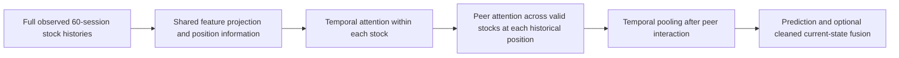

# After the data repair: training, attention and the remaining research work

13 September 2026. Prepared for independent LLM review against repository commit `be1701c9210348bb4cbd3b654c34d00fe29ed37f`.

This document consolidates [our post-Round-7 audit](v2_POST_ROUND7_PIPELINE_AUDIT.md) and the supplied `v2_round7_postmortem_pipeline_audit.md`, removes completed data work, and adjudicates the supplemental findings individually. It incorporates the user's preference for stronger, better-motivated regularization and an effective test of attention before temporal summarization. It is a recommendation document, **not a new experiment registration or a record of implemented training changes**.

## 1. Readiness: the numerical data pipeline is ready for the next stage

The accepted data contract is [v2_data_inputs.json](v2_data_inputs.json), not the old Round-7 pointer. A fresh read-only verification checked the actual contents of **all 105 array files**, the canonical/evidence hashes, the corrected financial family, and **151 distinct correction-evidence files**. All passed. The 73 protected arrays still match the parent; the retained fields have no lost support; actual target-bucket assignments remain unchanged. [Readiness evidence](v2_next_stage_readiness.json) records this check and hashes both review documents.

The previous CPU acceptance covers P, F2 and F14 through the actual S0/C1 loaders and FP32/BF16 forward paths, with full 60-session history and all active names. I reviewed the current implementation against those results; I did not rerun already-passed full suites or train a model during this review.

The demonstrated data problems in both audits have been addressed:

| Data finding | Accepted resolution |
| --- | --- |
| Wrong filing money/share units, treasury subtraction and dependent fiscal bridges | 43 currency and 27 capital/treasury filing corrections, source-bound and applied at their own historical availability; dependent features rebuilt. |
| New incomplete statements suppress older usable facts | Per-field coherent fallback, actual dependency requirements, original revision/receipt ordering and an incomplete-latest flag. |
| Signed equity/earnings lost or conflated with missingness | Signed physical values retained; negative-earnings information represented explicitly. |
| Sparse auxiliary observations removed by rank-support gates | Continuous representation throughout the affected sidecars; 202,987 existing-field observations recovered, zero lost. New flags are counted separately. |
| Inconsistent scales and P-to-F coordinate changes | Fit-only robust conditioning, smooth tails, saved inference preprocessing, inherited established P coordinates, and fit-only activation of cold fields. |
| Old dependency age mistaken for update freshness; age dropped when value invalid | Separate freshness semantics; value validity and known age remain independent through consumers. |
| Moment/history/rate saturation | Smooth uncapped-tail moment encoding, history age that distinguishes more than 252 sessions, and removal of the annual lending-rate cap. The rate path uses `asinh(rate / 0.01)` before consumer conditioning; it is not literally raw physical rates at the network. |
| Duplicate native fundamentals | One canonical financial family in the accepted store and current all-input configurations. |
| Lost warm-up and security-order-dependent target ties | Full source warm-up retained; average-rank tie handling; zero actual development bucket changes. |

There are **two minor cleanup remnants**, so my previous statement that legacy code was completely removed was too broad. Four magnitude formula strings still mention obsolete percentile clipping even though the executable consumer does not clip. The old native-family specification/test and earlier Round-7 construction paths also remain in source. They do **not** feed duplicate data into the accepted store. Correct their descriptions and retire superseded entrypoints during the next implementation freeze; do not mutate a sealed manifest in place or remove shared source helpers still needed by the accepted builder. If a metadata change requires a new contract, verify byte identity of all numerical arrays. These are implementation/metadata cleanup items, not evidence of continuing numerical suppression.

The remaining source limitations are real: 86 unit-triage candidates still lack a recovered exact original PDF; historical vendor revisions are imperfect publication vintages; partial OI, class-price valuation coverage, borrow availability, reconstructed sessions and inferred terminal/action accounting retain their disclosed qualifications. This is not a certification of every vendor observation. It is sufficient for controlled development experiments under the existing contract. New evidence of a material timing, identity or numerical defect would reopen data acceptance; a bad experiment result alone would not.

**Do not repeat the old coverage assumptions.** On the repaired P fit rows, sector's two relative-return fields now have 7,068 observations each and sector momentum has 5,896. The two option-volume fields have 17,736 and 21,848. Lending and rebalance still have none; several commodity, flow, after-hours and OI fields are also absent. Fundamental fields have differing support rather than one family-wide coverage rate. Use the per-field census when deciding what a parent can learn.

## 2. The diagnosis that remains after subtracting the data work

The strongest evidence is severe training-set overfit, followed by a protocol that kept late weights after useful selection performance had disappeared. Final-epoch screen averages from the saved histories are:

| Model / recipe | Clean training IC | Selection IC |
| --- | ---: | ---: |
| S0 slow, R, SAM .125 (A1) | .0743 | .0367 |
| C1 slow, R, SAM .125 (B1) | .1831 | .0311 |
| C1 slow, R, SAM .05 (B3) | .2763 | .0214 |
| C1 all, R, SAM .05 (B4) | .7689 | .0045 |
| C1 all, R, SAM .125 (B5) | .6771 | .0150 |
| C1 all, AdamW F (B11) | .8110 | .0056 |
| Early peer / temporal attention (TE) | .8076 | .0070 |

These are training/selection diagnostics, not the official tail-average evaluation scores. In particular, B5's stronger SAM improves its final selection readout but its official screen IC, .005324, is below B4's .008553. “Increasing rho has already won” would be an incorrect conclusion.

B4's twelve calibration curves peaked in mean selection IC at epoch 3, around .0119. The permitted budget choices began at 20; mean selection IC at epoch 20 was about −.0026 while training IC was .8151. C1-all P also ended around .6992 training IC versus .0066 selection IC. Data corrections do not erase these observations, and the old results do not determine the corrected models' behavior.

The remaining hypotheses are related but distinct: excessive flexibility relative to independent dates, memorized context/coverage combinations, unstable economic relationships, bad parent checkpoints or transfer dynamics, optimizer geometry, and a target that removes some of the variation the new datasets predict. Neither review establishes that any one of them explains the whole failure.

## 3. Healthy training: agreement, disagreement and the actual objective

I agree that selecting an earlier checkpoint is not a sufficient response to a model that rapidly memorizes the training set. We should improve the **trajectory**, so useful out-of-sample behavior persists across a reasonable region of training rather than appearing as one accidental spike.

I disagree with targeting a training/validation gap near zero. The training statistic is measured on observations used to fit the weights; the later statistic also includes estimation noise and distribution shift. A model with training IC .001 and validation IC .001 has an excellent gap and little useful signal. A model with .08 and .04 could be much more useful. These are illustrative numbers, not acceptance thresholds. We should not reduce useful validation performance merely to make the gap look smaller.

The practical definition of healthy training is:

- Selection performance improves over its initial state and the matched control, survives adjacent checkpoints and later chronological blocks, and is reasonably stable across seeds.
- Increasing training fit does not repeatedly coincide with collapsing selection performance. Full-network .8 training IC with negligible later IC is a strong warning, not a desired utilization of model capacity.
- Nontrivial peer/market relationships can be learned in independent-date engineering tasks, and useful real-data relationships survive chronological evaluation.
- The chosen result is not explained solely by one issuer, era, coverage pattern or unwanted style exposure.

Early stopping remains useful even after regularization improves. It limits fitting noise and stale relationships and selects among model states; no optimizer guarantees that continuing indefinitely is harmless. The goal is less sensitivity to checkpoint choice, **not removal of checkpoint selection**.

SAM is itself a regularizer: it favors solutions robust to specified weight perturbations. That is a compelling inductive preference, but it does not identify causal alpha or make nonstationary financial observations independent. Its published results motivate its use; they do not guarantee a small gap here. [SAM](https://arxiv.org/abs/2010.01412)

Nor are dropout and weight decay intrinsically makeshift. They impose other preferences, which can help or hurt. I would keep their present modest values as controls, prioritize adaptive SAM, and avoid immediately escalating global dropout/decay or deleting input channels. The ASAM paper itself combines sharpness-aware updates with conventional regularization; these mechanisms are not mutually exclusive. [ASAM, sections 4–5](https://proceedings.mlr.press/v139/kwon21b/kwon21b.pdf)

## 4. First implementation: selection-aware training and trustworthy diagnostics

These are required engineering changes before a large new campaign:

1. **Select from early checkpoints.** Evaluate the complete selection window from epoch 1; remove the arbitrary minimum budget of 20. Start with a generous safety ceiling, such as the existing 60 epochs, and a fixed patience policy. A sensible initial proposal is five selection checks without meaningful improvement; the improvement/tie rule and any ceiling-extension rule must be frozen before evaluation scoring. Do not announce epoch 3 as the universal optimum or shorten every run to three epochs.
2. **Separate schedule and stopping.** Specify warm-up and the LR schedule in update units, account for unique-date batches, and keep the same schedule when comparing checkpoints along a trajectory. Compare recipes with declared schedules; an early checkpoint from a 60-epoch cosine run is not equivalent to a freshly scheduled three-epoch fit.
3. **Score the weights actually selected.** The default candidate should be a selection-chosen raw checkpoint. If EMA/SWA/local weight averaging is tested, evaluate that exact state on selection and bind its own preprocessing. Do not assume an average of late overfit states is useful. Keep averaging as a separately identified variance-reduction alternative, not a silent replacement after evaluation results are seen.
4. **Record informative curves cheaply.** Log training loss, full selection IC and a fixed, era-stratified clean-fit probe every epoch, with dropout disabled for IC. Measure full clean-fit IC at the selected and terminal checkpoints. Clearly distinguish a probe from the full fit set. Requiring a full training-set inference pass at every epoch for every run is unnecessary overhead; calibration can use denser diagnostics.
5. **Measure optimization, not just terminal loss.** On fixed fit-only probe dates at initialization, early training and the selected state, log gradient/update-to-weight norms by major module, clipping frequency, clean/perturbed loss, standardized score movement under SAM, and peer-route contribution. Global weight norms alone do not determine functional regularization.
6. **Fix optimizer parameter routing.** The code promises to exclude every bias from decay but misses GRU `bias_ih_l0` and `bias_hh_l0`. Correct this by parameter/module identity rather than a fragile suffix. Explicitly decide how LayerNorm and TabM multiplicative factors are treated. Calling decay of TabM factors a universal bug is unjustified; document the chosen policy. Its likely small historical effect is not a collapse explanation.
7. **Bind the new run to the repaired store.** The frozen Round-7 orchestrator still targets its old pointer and recipe. Build the next declared experiment from the current pointer and explicit parent/graph contracts. Do not repurpose an old command and assume it uses the repaired data.

Use saved histories/checkpoints for a bounded **historical** checkpoint-policy analysis if useful: declare a selection-only rule, compare selected early states with the saved tail state on a small matched set, and label every new evaluation readout post-hoc development evidence. This can explain the old result; it cannot validate the repaired inputs. Avoid a large CPU rescore of every epoch/family merely because artifacts exist.

## 5. Regularization and transfer: prioritized experiments

### 5.1 Adaptive SAM is the first optimizer extension

Keep absolute SAM .125 as the primary control and .05 as a diagnostic reference. Test a properly specified **ASAM** implementation next. A larger model does not automatically need a radius proportional to its total weight norm; raw sharpness depends on parameterization. [Dinh et al.](https://proceedings.mlr.press/v70/dinh17b.html)

For the diagonal adaptive metric, the first-order L2 perturbation is:

`epsilon = rho * T(w)^2 * gradient / ||T(w) * gradient||_2`

where an elementwise choice uses `T(w) = diag(abs(w) + eta)`. This is **not** the supplement's proposed per-tensor rule `rho * ||w_tensor|| / ||gradient_tensor||`, which defines a different neighborhood. The stability term and treatment of biases/normalization parameters must be explicit. [ASAM, Algorithm 1](https://proceedings.mlr.press/v139/kwon21b/kwon21b.pdf)

Our zero-initialized FiLM outputs and new residual paths make the near-zero-weight behavior important: an unqualified `abs(w)` multiplier can leave newly introduced directions almost unperturbed. Verify the metric constraint, exact restoration, finite zero-gradient behavior and cold-module gradients in FP32 and BF16. Preserve the same date batch and stochastic realization for the two SAM evaluations; do not accidentally turn a change in dropout mask into an adversarial-loss diagnostic. Separate base-optimizer decay from the sharpness calculation.

Recommended bounded pilot: start the rich models at peak LR `1e-4`, compare absolute SAM `.125` with ASAM `.2` and `.5`, and retain a matched `3e-4` LR bridge and `.05` SAM reference where needed to identify the effect. These are **trial values**, not selected optima. Expand toward ASAM `1.0` only if diagnostics/selection justify it; do not import `.5/1.0` as universal defaults. The paper used different radii for image tasks and its Transformer translation experiment. Numerical rho values are not comparable across different metrics.

ASAM still uses two gradient evaluations, so its expected additional work is mainly elementwise scaling and reductions. Verify actual throughput and memory; do not assume equal wall time or substitute a one-pass approximation before correctness is established.

### 5.2 Preserve useful representations without freezing the whole model

The R recipe fine-tunes every layer at the full peak LR with a fresh AdamW. Test the existing `.3` transferred-parameter LR multiplier against `1.0`, with new modules at the base LR, while keeping other choices fixed. Parameter provenance must determine the groups. This asks whether the model is destroying a useful initialization, not whether small learning rates always help.

Pretraining also needs selection-aware stopping. Do not reuse C1's overfit epoch-60 parents by default. On a bounded matched subset compare:

- A fresh start on F's permitted fit data.
- A newly selected compatible P parent with all fields actually supported during P.
- A slow-core P parent with explicitly initialized new family/context components at F.

Slow-only P is a useful control, not a compulsory deletion of meaningful fundamental/sector data during P. The repaired census disproves the premise that sector is universally absent there. Conversely, a parent cannot learn historical lending/flow values that do not exist in its fit window. Keep established scaler coordinates, record cold fields, and never extend P into future eras just to obtain coverage.

Slow-to-all transfer changes fusion dimensions. Do not silently use `strict=False` and assume transfer succeeded. Name the tensors/submatrices that are reused, initialize new columns explicitly and verify the intended initial predictions. Retain identity/freshness channels; age or presence need not be deleted merely because they can act as shortcuts.

### 5.3 Better structural preferences before indiscriminate regularization

Prioritize shared temporal/peer projections, residual own-stock paths, and direct tests of conditional input contributions. This constrains how relationships are learned while preserving the supplied history and universe.

A promising separate candidate is a small additive branch around a strong baseline, initialized so new information does not immediately overwrite its useful signal. Test a regularized linear/current-state control before a large nonlinear branch. If baseline predictions become training features or residual targets, construct them with chronological cross-fitting; do not use optimistic in-sample residual labels. Frozen baseline dependence must not be mistaken for independent alpha discovery.

If common-state sensitivity remains a problem, compare the full FiLM path with a simpler learned modulation/additive path **using all 44 inputs**, and with an explicit FiLM bypass. A low-rank interaction parameterization can be tested without preselecting eight principal components and discarding potentially useful low-variance inputs. There is no established best rank; it is an architectural hypothesis.

Targeted family dropout or prediction-consistency regularization belongs in a second tier, only after a diagnosed brittleness and an unchanged clean-input control. Whole-family removal can erase the very incremental signal we seek. Age jitter may blur real announcement timing. Neither should be mandatory preprocessing. [R-Drop](https://papers.neurips.cc/paper/2021/hash/5a66b9200f29ac3fa0ae244cc2a51b39-Abstract.html) motivates consistency between stochastic predictions, but adapting a classification KL penalty to our rank scores requires a specified objective and additional compute; it is not a drop-in cure.

GSAM is a reasonable reserve optimizer because it distinguishes the perturbed loss from its gap to the original loss. It is more relevant than an arbitrary optimizer sweep if ordinary/adaptive SAM still fits shortcuts while peer learning stalls. Do not run it in a full cross-product with every architecture at the outset. [GSAM](https://arxiv.org/abs/2203.08065)

Recency weighting, rolling fit windows and coverage-balanced sampling are later nonstationarity experiments. More aggressive recent weighting reduces effective history and can worsen overfitting. Keep all active names and unique-date batches; do not throw away overlapping samples solely to make them look independent. Account for dependence in uncertainty estimates.

## 6. Make attention a priority—and test it fairly

### 6.1 What already exists, and what remains untested

The TE path already retains a temporal sequence, mixes stocks at each historical position, and only then pools time. GE does the same with GRU hidden sequences. They do **not** summarize each stock to one vector before the early peer operation. Their poor outcomes do not establish that this ordering is wrong: they were attached to the overfitting all-family C1 model under one SAM setting and the late-checkpoint policy.

B9 is different: it applies attention to the final fused current state. Its QKV/output layers use the global `.02` initialization, while `PeerAttention` receives Xavier initialization. That inconsistency warrants correction and an isolated check. It does not establish that B9's attention was mathematically disabled or that its whole result can be discarded. Gradients reached that path. The successful Xavier component test did not make the full SAM model pass the peer teacher.

**Give attention a dedicated slow-input experiment early.** Do not require an all-family/FiLM model to recover first. That would let a separate input-fusion problem indefinitely block the question the user wants answered. Then test adding cleaned current-state information to the healthy early-attention candidate.

### 6.2 Recommended main attention pathway

Use exact factorized temporal and cross-stock attention, preserving each historical position until after peer interaction:

The current TE implementation is a starting point, not a reason to rewrite the entire system. Preserve its masked residual route and inspect the mixed pre/post normalization and projection scales. A standardized, tested residual/normalization layout is preferable to changing width, depth and several normalizations at once. Keep learned peer attention distinct from a uniform pooled-context control. A linear or modest readout is a useful diagnostic of whether the large C1 trunk absorbs the training fit; it is not a blanket instruction to shrink every model for speed.

Capacity allocation deserves its own controlled test. A large total parameter count does not rule out an overly narrow useful encoder followed by an unnecessarily flexible readout. If the healthy model still fails conditional family/peer tasks, compare projection width or a small nonlinear input adapter, then reallocate capacity toward temporal/relational processing with the readout controlled. Do not infer an encoder bottleneck solely from a large training/selection gap, or increase every layer together. This preserves the possibility that a better-structured, equally large model generalizes better.

Bidirectional temporal attention **within the fully available historical window** is compatible with a single future decision. It is not look-ahead merely because a token at an earlier historical position sees a later position that is still before the decision. The current `HistoricalAttention` follows that contract. If tokens are later reused as historical online states at earlier decisions, their information sets must be changed accordingly. Never impose an unnecessary triangular mask just to call the model causal.

The literature supports this as a motivated candidate, not the unique “canonical” winner. MASTER uses intra-stock attention, per-time stock attention and final pooling; it employs a linear feature projection, so linear projection alone is not a demonstrated defect. Its experiments use Chinese CSI300/800, Alpha158, eight input steps and a five-day target, with a different objective and portfolio. [MASTER](https://arxiv.org/html/2312.15235v1)

HIGSTM uses hierarchical Mamba/spatial relationships on CSI500/800/1000, 3,159 dates, 16-step inputs and 45 stated price/volume/valuation/share/money-flow features. Its appendix defines stock lists using end-2023 constituents; I infer survivor conditioning from that description. It does not prove that temporal summarization is universally safe or that attention must win on our PIT-neutralized Brazil task. Keep Mamba as a later encoder control, not the next mandatory rewrite. [HIGSTM](https://arxiv.org/html/2503.11387v1)

### 6.3 Attention engineering must test relational learning, not memorization

Before a large financial run, require independent synthetic training and validation dates and several teacher tasks: own-stock history, same-date peer relation, lagged peer relation, and a context-dependent peer relation. Construct at least one task where the own-stock shortcut has no predictive information. Do not provide hidden peer IDs or relation labels that would be unavailable to the financial model. Include masks, missing histories and different universe sizes.

Compare full models under the **actual proposed SAM/ASAM schedule** with an AdamW optimization diagnostic. Passing a component-only MSE test or repeatedly fitting one batch does not establish that the full rank-loss recipe can learn the relation. Conversely, failure on a particular toy teacher is not proof that financial alpha is impossible: diagnose the teacher, scaling, objective and optimization separately.

Measure own-only/mean-peer controls, peer-input interventions, routing contribution, gradients and prediction changes on unseen synthetic dates. Inspect QK logit scale, attention entropy relative to the number of valid keys and head diversity as diagnostics. Uniform attention can be useful; low entropy is not a success criterion. Attention weights alone are not explanations. A large campaign should not proceed while the intended route cannot beat its declared shortcut control on a suitable relational task, unless the limitation is resolved explicitly before financial scoring.

For the financial comparison, use the same data, histories, head/target masks, fusion/readout, parameter scale and selection policy in early versus late paths. Give both a comparable small LR/regularization tuning budget; one shared rho is useful for a controlled comparison, but does not establish each model's attainable performance. Include slow-only and all-input contrasts so attention timing is not confounded with sidecar usefulness.

The aim is to give attention a fair opportunity, not to search until it wins. Strong evidence for a simpler model would mean it survives repaired inputs, functioning relational learning, competent selection/optimization and matched chronological/seed comparisons. Even that conclusion applies to the tested designs and budget, not to all possible attention mechanisms.

### 6.4 Efficiency without changing the question

Retain the 60-session lookback and every eligible stock. Batch dates and use stage-fixed compact padding. Compute historical encoders once per stock/date; do not repeat them for ensemble members. Use fused attention where the actual masks permit it, FP32 optimizer state/loss/reductions and BF16 forward paths with parity checks. Benchmark forward **and backward**, collation, transfer, validation and peak memory on real masks; an isolated forward benchmark is insufficient.

For illustration, with N=243 and T=60, one head's pairwise score counts are approximately 212.6 million for full attention over NT tokens versus 4.42 million for separate temporal and per-time peer attention—a roughly 48-fold reduction in pair count. This is our arithmetic, not a promised 48-fold wall-time speedup: projections, FFNs and data movement remain. The factorization also changes the relationship class; it is a declared modeling preference, not an exact replica of joint attention. No stock or lookback observation is removed.

Market/fundamental histories should be a subsequent representation experiment. Current snapshots and FiLM cannot recover arbitrary missing response trajectories. Start with a compact release-aware market sequence or one event/fundamental surprise history, aligned at each historical decision. For common-market/stock cross-attention, encode market tokens once per date, retain variable identity and availability, and let stock queries read them. Compare it with the current-state conditioning path. Do not tile 44 common fields as if they were independent stock observations, or forward-fill a revised filing backwards. This is new information delivery, not unfinished cleaning.

## 7. Objective, evaluation and economic interpretation

Retain the current objective for the first training/attention comparisons. It is a coherent multi-day idiosyncratic ranking target, but not the same task as forecasting unneutralized total returns. Before changing it, report raw return, volatility-scaled return and neutral-target diagnostics on common populations, together with score exposures. A useful macro variable can predict removed style variation and still add little to the chosen target.

Compare per-head IC and the actual composite-score IC on identical masks. Report how training's per-head population differs from common-head selection and the traded population. Examine marginal turnover, costs, borrow constraints and position persistence from scored panels. Do not change the execution model mid-architecture comparison to rescue a preferred model.

B8 changed the surrogate to Pearson-on-ranks; it did not test cardinal-return labels or remove neutralization. Its poor result does not close those questions. Later controlled candidates include a magnitude-aware robust return loss, a declared tail-weighted ranking objective, or moving some neutrality constraints from labels into portfolio construction. Each changes the objective and needs exposure-aware paired economics. Direct Sharpe/differentiable-backtest optimization is a low-priority first remedy given noisy costs and unresolved valuation labels.

Reassess family contribution conditionally on S0/slow inputs using chronological cross-fitting and blocked uncertainty. Univariate predictive power plus low pairwise correlation is not proof of incremental alpha. Include issuer/sector and era sensitivity, but do not label a leave-issuer-out experiment as the production task: it tests a different kind of transfer.

Use paired date-block inference across arms, preserving all same-date names, horizons and seeds together. Overlapping labels and rolling windows are not independent observations; folds with overlapping histories are not independent replications. Fix block choices before comparison and show a longer-block sensitivity. Report seed dispersion and omission sensitivity, not only a rank-ensemble headline. Keep three matched decision seeds initially; add seeds only under a predeclared ambiguity rule rather than automatically repeating another three.

All of 2010–2024 is repeatedly studied development history. Reusing selection data across many recipes can overfit the research process itself. A larger search requires stronger multiplicity caution and a record of every attempt. Additional development folds are broader evidence, not a newly untouched holdout. The 2025/2026 consumer ban remains; no new read is authorized here.

## 8. Disposition of the supplemental findings F1–F13

| Finding | Judgment after verification | Remaining action / rejected inference |
| --- | --- | --- |
| **F1: unscaled family inputs** | Valid defect; repaired. | Remove it from the work queue. BF16 resolution at a large activation does not by itself prove every small input was numerically invisible; measure combined activations rather than claiming deterministic erasure. |
| **F2: uncentered magnitudes / neutrality** | Scaling defect repaired; neutrality is an open design question. | Keep all four inputs. Reject mandatory deletion just because related styles were neutralized; interactions and conditioning can remain useful. |
| **F3: P/F coverage and coordinates** | Coordinate defect repaired; coverage/transfer risk remains. | Use the updated field census, selected parents and cold-module treatment. Reject the old claim that sector has zero P support now, and reject a blanket ban on all-family P. Coverage-as-feature correlation alone is not causal proof. |
| **F4: FiLM and ages identify observations** | Plausible mechanism; not established as the sole cause. | Run controlled bypass/fusion/transfer tests. Reject mandatory eight-PC compression, age jitter or age deletion. A ±.01 intervention-IC threshold is not a universal fingerprint detector. |
| **F5: capacity/regularization/budget** | Strongly supported, with a more serious early-checkpoint exclusion than the supplement established. | Improve trajectories and selection together. Reject total-weight-norm reasoning as a sufficient rho prescription and do not equate “B=20” with evidence that learning was healthy before epoch 20. |
| **F6: P asymmetry and full-LR F** | Valid confound and high-value experiment. | Selected compatible P, explicit transferred/new LR groups, fresh-start and slow-core controls. Fixed 60-epoch C1 P is not a good default. |
| **F7: B9 initialization** | Real initialization inconsistency / plausible optimization issue. | Unify and test attention initialization. Reject “B9 never tested attention” as proven fact. Xavier's component success did not establish full SAM relational learning. |
| **F8: support gate and duplicate fundamentals** | Valid; current inputs repaired. | Preserve recovery and remove remaining old construction/specification remnants during implementation cleanup. Do not count native/ranked coverage gains twice. |
| **F9: clips and history saturation** | Data issues repaired, including loan-rate clipping. | Keep smooth tails and history distinction. Reject replacing everything with ranks or deleting history age by default. |
| **F10: age/mask inconsistency** | Valid contract defect; repaired. | Retain its tests; no new age-loss rule. |
| **F11: inadequate engineering acceptance** | Valid criticism of what single-batch fitting can establish. | Use unseen-date full-recipe relational tests, source causality tests and real-data diagnostics. Targets being generated from inputs is normal in a teacher task; lack of independent evaluation was the issue. A lag-IC peak does not prove misdating. |
| **F12: decay routing** | GRU bias routing violates the intended policy; effect not shown to be material. | Fix bias classification. TabM factors need an explicit policy, not an unsupported universal “no decay” rule. |
| **F13: reviewed invariants are sound** | Broadly supported for the reviewed paths, strengthened by data acceptance. | Preserve PIT identity, masks, purges, entry exclusion and compact-name invariants. Reject “no leakage anywhere” as an exhaustive certificate; historical sources retain declared limitations. |

Other supplemental proposals also need correction. Zeroing common validity does **not** necessarily make a trained FiLM network inert: its biases can still generate gamma/beta. A true bypass sets the modulation to identity explicitly. Family value-only, age-only, presence-only and full-removal probes answer different questions; masked data must follow the new age contract. Such interventions can be off-distribution and are sensitivity diagnostics, not causal feature importance.

Do not require an all-family model to improve before testing early attention. Do not use the supplement's proposed ASAM tensor formula, fixed .2/.3 dropout settings, fixed PCA dimension, or evaluation-triggered switch of checkpoint policy without a separate declared comparison. A policy may be proposed after seeing development evidence, but the next evaluation protocol must identify that adaptation rather than silently rewriting an earlier decision.

## 9. Recommended sequence and decision gates

This ordering preserves attention priority without launching a combinatorial architecture/optimizer/feature sweep.

| Stage | Work | What it can establish |
| --- | --- | --- |
| **A. Engineering and protocol** | Correct selection/averaging and bias routing; implement/test ASAM; unify attention initialization; bind current data; clean the two metadata/legacy remnants; specify transferable tensors and logging. | Correct execution of the intended experiment. No new-alpha claim. |
| **B. Bounded optimization calibration** | Use fit/selection-only curves and independent synthetic dates. Pilot a small SAM/ASAM/LR bracket on an early-attention model and a representative rich model, retaining controls. | Which settings merit the financial screen, whether peer routing learns, and whether a pathological trajectory persists. Not a final architecture ranking. |
| **C. Fresh matched screen** | New S0-slow baseline; selected GRU/C1 reference; early-attention slow model with a matched late control. Then add the cleaned family path to the strongest relevant reference and early-attention model; isolate FiLM separately. | Architecture timing, conditional family contribution and common-state contribution without confusing them. |
| **D. Conditional follow-ups** | Parent-vs-fresh transfer, additive/low-rank fusion, targeted consistency or GSAM only where diagnostics justify them. | Resolution of a specific remaining failure, rather than another broad search. |
| **E. Broader development confirmation** | Freeze survivors, policy and seeds; complete matched remaining folds and economic evaluation. | Reproducibility across more development periods and the existing book—not proof of future profitability. |
| **F. Representation/objective research** | Small market/event histories, market-stock cross-attention, then separate target/loss/capacity ablations. | Whether information absent from current snapshots or the objective is the next bottleneck. |

The standard screen remains F2/F6/F10/F14 with seeds 11/29/47: **12 F fits per complete cell**, not 36. P fits are additional only when the parent contract changes. Stage B may use fewer runs for engineering triage; it cannot declare a financial winner or reject attention from one unlucky seed. Reuse compatible completed fits when moving from a screen to remaining folds, with identical data, schedule, parent and selection contracts. Keep all attempts in the research record.

**A freshly trained baseline is required.** Three slow encodings changed in the data pass. Old A0 scores and parents therefore are not an exact comparator for a new model trained on this store. They remain historical controls. New S0 and new compatible P parents must be included in compute planning; do not obtain apparent savings by mixing input contracts. Likewise, the supplement's suggestion to reuse existing C1-slow parents without this qualification is no longer appropriate.

The fresh incumbent S0 control retains its accepted training/selection/averaging recipe. Do not weaken that control by forcing it onto an unproven replacement policy. A separate S0 under the proposed common recipe can isolate the recipe effect. Early-versus-late attention comparisons should be matched within that recipe; a practical comparison of each architecture's tuned recipe against the incumbent answers a different question and should be labeled accordingly.

Before paid work, freeze the exact small roster, parent policy, budget/stopping rules, paired metrics and continuation gates. Evaluate numerically healthy pilots across seeds; do not require an arbitrary near-zero training gap or reward a collapse in both training and selection IC. Advance a candidate for stable paired selection/evaluation contribution under the declared research protocol, with all post-hoc choices disclosed. If the first all-family model still fails, follow the diagnosed path—fusion, parent, optimization or objective—while keeping the independently functioning attention lane available.

Measure complete-fit throughput after these changes before giving a wall-clock estimate. Early stopping should avoid much wasted late training, ASAM can reuse the two-pass implementation, and factorized attention keeps the full data while limiting pairwise work. Those are reasons to expect a faster, more informative program; they are not benchmark results.

## 10. Coverage of our original recommendations

The consolidated queue retains every substantive non-data item from our audit: trajectory/overfitting diagnosis; early checkpoint and average-state selection; stronger/adaptive regularization; parent selection and differential transfer LR; conditional family/context contribution; meaningful full-model relational tests; attention before pooling; nonstationarity and effective sample size; missing market/event histories; residual/additive learning; target/neutrality/head/composite alignment; turnover/cost/exposure interpretation; and restrained, matched chronological experimentation. The latent target-tie defect and all other completed data fixes are closed in section 1, rather than proposed again.

What has deliberately **not** been decided is the best architecture, best rho, optimal model size, an improved alpha estimate or a new research designation. The next program should answer those questions with a functioning data and training contract, rather than assume that either a paper's headline result or an optimizer's theory settles them.
