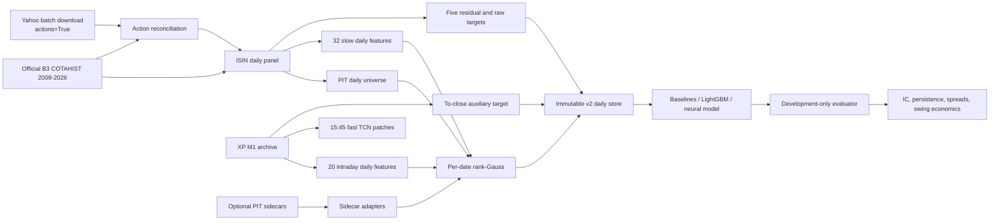
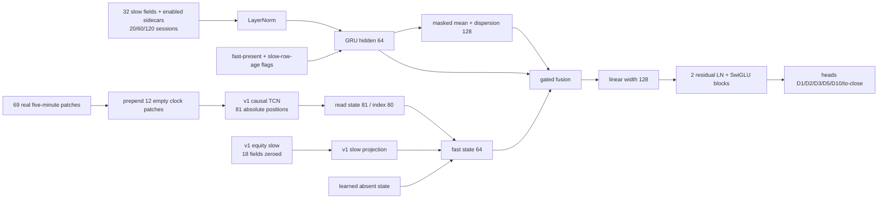

# Brazil-RV v2 daily model

Brazil-RV v2 is an additive daily research stack. It predicts cross-sectional
total-return ranks over 1, 2, 3, 5, and 10 B3 sessions and makes one decision
per session at 15:45 for a closing-auction entry. The v1 intraday package,
artifacts, and deployed recipe are unchanged.

This document describes the implementation contract. It does not authorize an
official-validation or test read and it does not describe a live trading
system.

## Data flow



## Identity, calendar, and timing

Permanent equity identity is the 12-character B3 ISIN (`CODISI`). Ticker is a
dated attribute represented by one or more `(ticker, first_date, last_date)`
segments in `security_master.parquet`. Fallback ticker identities are rejected.

The session calendar contains COTAHIST dates with at least 50 distinct traded
cash equities. The raw foundation includes 2009 for lookbacks; persisted store
rows begin on 2010-01-04. The current v1 physical date axis has exactly 1,248
sessions from 2021-07-19 through 2026-07-17, including its pre-fine-tune warm-up
rows. Store construction asserts that this complete axis equals the matching
COTAHIST calendar slice. Stage F samples begin later, on 2021-08-16.

All 158 accepted v1 `security_id` values must map one-to-one to distinct ISINs
on the v2 axis. The PIT audit requires each mapped identity to be active at
least once from the Stage F start; it deliberately does not claim that all 158
are active simultaneously on every date.

The M1 grid starts at 10:00. V2 has exactly one decision sample: index 345,
the instant the 15:45 minute opens. Completed intraday bars are indices 0–344.
The high, low, close, and volume of minute 345 are never inputs. V1's last
stored decision is 14:45, so v2 synthesizes the new cutoff rather than
mislabeling a v1 sample.

## Daily panel and corporate actions

The source panel keeps cash-market type 010, standard-lot BDI 02, and
ON/OR/PN/PNA–PNF/UNT securities (plus any explicit accepted-v1 exception).
Each observed row contains raw OHLC, BRL volume, trade count, and quantity.

Corporate actions are fetched in bounded ticker batches with
`yfinance.download(..., actions=True, auto_adjust=False, group_by="ticker")`.
The result is cut back to each dated ticker segment before it is bound to ISIN
and written to an immutable, hash-recorded cache. The acquisition audit keeps
`downloaded`, `cache_hit`, `zero_actions`, and `failed` distinct: a successful
zero-row response is evidence of no provider action, while a missing or failed
provider response is not. Observed rows inside a failed ticker segment are
marked `provider_action_failure_mask` and therefore unresolved for targets,
price-derived features, and realized portfolio PnL.

The canonical action schema can represent split, reverse split, bonus,
dividend, JCP, and subscription rights, but the implemented free Yahoo source
guarantees only dividends and stock splits. Its cash-distribution field cannot
reliably distinguish dividend from JCP, and it does not guarantee separate
bonus or subscription-right records. Yahoo rows use `known_date=ex_date`: they
can drive the adjustment from the ex-date, but they do not support a
pre-announcement event feature. These taxonomy and coverage limitations are
recorded per ISIN-year in `corporate_action_coverage.parquet`, including ticker
segment counts and the exact `covered_actions`, `covered_zero_actions`,
`provider_failure`, `partial_provider_failure`, and `no_acquisition_segment`
states.

Split candidates are independently flagged when the absolute close-to-close
log move exceeds 0.35 and the quantity move approximately offsets it. A
detected/recorded split mismatch, a COTAHIST distribution-number change without
a recorded action, or a provider-failed segment is unresolved. The relevant
review tables retain those cases. Every target or price-derived slow-feature
interval crossing one is masked, and a held portfolio interval whose exit is
unresolved is excluded from realized economics without changing its
previously formed weights.

A recorded cash event can fall on a market session when that exact ISIN did not
trade. In that case there is no COTAHIST ex-date close at which to apply the
specified reinvestment. The store never substitutes a stale, later, or
cross-provider price: it leaves that cash multiplier neutral, records the cell
in `cash_reinvestment_unavailable_mask` and
`corporate_action_cash_reinvestment_review.parquet`, and marks it unresolved.
Trailing return, volatility, range, high-watermark, and adjusted-price features
crossing or landing on the unresolved break are also invalid. Activity-only
features retain their own independent masks.

Adjustment factors are forward-recursive. A future action never rewrites an
earlier row. On an effective date, split/bonus factors make the price series
continuous; cash distributions are reinvested at the ex-date close for the
total-return-close series. The action audit records source/cache hashes,
ISIN-year coverage, disagreements, and an M1 adjustment-status check using both
event-day close levels and pre/post-event ratios.

## Point-in-time universe

A name is eligible on session `t` from information available before `t` when:

- it traded on at least 15 of the prior 20 market sessions;
- its prior-20-session median BRL volume, counting missing observations as
  zero, is at least R$2,000,000;
- its prior close is at least R$1.00; and
- it has at least 60 market sessions of listing history.

Eligibility is distinct from observation, feature, score, and target masks.
That separation is deliberate: a future endpoint's availability must never
change the ranked universe or a portfolio formed at `t`.

## Store schema

`python -m brazil_rv.v2.build_store` creates one new
`v2_daily_store_<timestamp>` directory through a staging directory and an
atomic promotion. NumPy arrays are uncompressed and memory-mappable. The
manifest binds all axes, feature names, source paths/hashes, coverage tables,
array shapes/dtypes/hashes, action review, calendar assertions, and access
flags. `manifest.sha256` binds the deterministic manifest bytes.

Core arrays begin with `[date, isin]`:

| Array | Additional axis | Meaning |
|---|---:|---|
| `observed` | — | COTAHIST row exists |
| `active` | — | causal PIT universe membership |
| `raw_open`, `raw_high`, `raw_low`, `raw_close` | — | unadjusted COTAHIST OHLC |
| `adjusted_open`, `adjusted_high`, `adjusted_low`, `adjusted_close` | — | causal split-adjusted OHLC |
| `total_return_close` | — | split- and distribution-adjusted close |
| `price_adjustment_factor`, `total_return_adjustment_factor` | — | causal cumulative factors |
| `volume_brl`, `trade_count`, `quantity`, `distribution_number` | — | raw daily activity/action fields |
| `recorded_action_mask`, `distribution_change_mask`, `provider_action_failure_mask`, `split_disagreement_mask`, `cash_reinvestment_unavailable_mask`, `price_adjustment_unresolved`, `adjusted_price_level_valid`, `unresolved_action` | — | action evidence, target/return-feature exclusions, and persistent adjusted-price-level trust state |
| `slow_values`, `slow_valid` | 32 features | rank-Gauss slow library |
| `intraday_values`, `intraday_valid` | 20 features | rank-Gauss M1 summaries |
| `sidecar_<group>_values`, `sidecar_<group>_valid` | group features | optional PIT sidecars |
| `target_primary`, `target_valid`, `target_normalized_residual` | 5 horizons | primary midrank, mask, and pre-rank residual |
| `target_raw_midrank`, `target_raw_valid`, `target_raw_log_return` | 5 horizons | raw-return comparison target family |
| `target_to_close`, `target_to_close_valid`, `target_to_close_normalized_residual`, `target_to_close_raw_log_return` | — | optional 15:45-to-close target family |
| `fast_present` | — | exact M1 fast stream available |

The usual store does not duplicate the dense v1 minute tensors. Instead, its
manifest hash-binds the external v1 `equity_features.npy`, `equity_slow.npy`,
readiness array, schemas, and date/ISIN mapping tables.

Slow lookbacks are not materialized on disk. `V2DailyDataset` builds 20-, 60-,
or 120-session windows lazily. A pretraining sample ending on `t` uses the slow
row through `t`; a fine-tune/evaluation sample uses slow rows only through
`t-1`.

## Slow feature library

All windows are B3 sessions and use only rows through the slow cutoff.
Each raw value has a validity bit before normalization.

| Family | Features |
|---|---|
| Return | log total returns over 1, 5, 21, 63, 126, 252; 12-1 momentum = return 252 − return 21 |
| Volatility | Yang–Zhang 5/20/60; standard deviation of 5-session YZ over 60; 60-session return skew and excess kurtosis |
| Extremes | maximum daily return over 21; `log(close / 252-session high)` |
| Market exposure | 60-session beta and residual volatility against the daily cross-sectional median return |
| Liquidity | log 20-session mean BRL volume; current-volume z-score; 20-session mean `abs(return)/volume`; trade-count z-score; volume/20-session mean |
| Price shape | `log(H/L)` for 1 session; `log(max_{u=t-4,...,t} H_u / min_{u=t-4,...,t} L_u)` for the exact 5-session range; `(C-L)/(H-L)`; log adjusted close; log sessions since listing |
| Given graph | monthly 12-cluster peer mean returns over 5/21; name-minus-peer returns over 5/21; peer 21-session dispersion; the focal name is excluded and a row requires at least three other valid active peers |

Yang–Zhang uses

`sigma² = sigma_o² + k*sigma_c² + (1-k)*sigma_rs²`,

where `sigma_o²` is the sample variance of `log(O_t/C_{t-1})`, `sigma_c²`
is the sample variance of `log(C_t/O_t)`, `sigma_rs²` is the mean
Rogers–Satchell term, and `k = 0.34 / (1.34 + (n+1)/(n-1))`.

Peer clusters are recomputed at each month boundary from the prior 126 daily
median-removed returns with deterministic average linkage and 12 clusters.

## Intraday-derived daily library

These fields are valid only where the 158-name M1 archive exists. Same-session
fields use completed data before 15:45; full-session fields carry `_lag1` and
use the prior session.

- overnight return and open-to-15:45 return, plus 5- and 20-session sums;
- overnight minus intraday and its 20-session mean;
- prior-session last-30-minute return share, last-hour volume share, and
  close-versus-VWAP deviation;
- same-session VWAP deviation and range through the decision;
- realized volatility from 5-minute returns over 1, 5, and 20 sessions;
- 20-session realized skew, Roll spread, and Corwin–Schultz spread; and
- volume through 15:45 divided by its 20-session same-time median.

The Roll estimator uses sample serial covariance of 5-minute returns and is
valid only when that covariance is strictly negative; a non-negative estimate
is masked rather than reported as a zero spread.

## Optional sidecars

Every adapter emits `(values, valid, feature_names, coverage_by_year)`. Missing
archive fields stay exactly zero with mask zero; they are not imputed or
relabelled from a merely similar transformed field. The frozen schemas are
broader than what the currently known archives can support exactly:

| Group | Exactly backed by the known archive adapter | Frozen but currently unavailable |
|---|---|---|
| `lending` | raw balance divided by the aligned 20-session mean COTAHIST BRL volume and its exact 1- and 5-session changes; exact inversion of the archive's one-to-one taker-fee transform for the loan-rate level and its exact 5-session change | none |
| `events` | none | announced-earnings distances, forward distribution flags, standardized unexpected earnings |
| `options` | exact inversion of the archive's one-to-one transforms for one-session OI change divided by stock ADV20 and put skew | put/call OI ratio, ATM IV divided by its 20-session median |
| `oddlot` | raw odd-lot BRL-volume share and exact 5-session change | none |
| `rebalance` | all 21 Experiment-33 fields: seven release-safe state fields for each of IBOV, IBXX, and SMLL | none |
| `fundamentals` | `fund_leverage` as leverage, when present | log market cap, book-to-market, gross profitability |

The seven rebalance suffixes are `current_weight_sqrt`,
`preview_delta_signed_sqrt`, `preview_add`, `preview_delete`,
`preview_pressure`, `pre_effective_ramp`, and
`post_effective_reversal`. Events and the unrecoverable options fields remain
honest all-zero values with false masks and zero coverage; no merely similar
archive quantity is substituted.

An adapter may expose a value on `t` only when its source availability
timestamp is no later than 15:45 on `t`. Existing v1 D+1 publication rules are
preserved by the source's `available_date`/timestamp.

To add a sidecar group:

1. add its frozen feature tuple to `v2.contract.SIDECAR_FEATURES`;
2. provide an archive-column map and authoritative availability column;
3. call `materialize_sidecar` on the store axes;
4. rank-Gauss values inside the active universe;
5. include its values, masks, coverage, source identity, and tests in the
   store manifest.

## Normalization

For every date and feature independently, take valid active names, calculate
tie-aware average ranks, set `p=(rank_zero_based+0.5)/n`, and return
`clip(Phi^-1(p), -3, 3)`. Invalid values are exactly zero and retain mask zero.
No fitted scaler or future cross-section is used.

## Targets

For `D in {1,2,3,5,10}`, raw total return is
`r_D = log(TRC[t+D] / TRC[t])`. The primary pre-rank target is

`clip(r_D / (sigma_t*sqrt(D)) - cross_section_median, -5, 5)`.

`sigma_t` is the 20-session mean daily M1 realized volatility when available,
otherwise 20-session Yang–Zhang volatility. The primary target is its
tie-aware midrank scaled to `[0,1]`. The raw target is the midrank of `r_D`
without volatility normalization or median removal; raw log return is also
stored for spreads.

A raw target requires active membership at `t`, a close on every calendar
session from `t` through `t+D`, and no unresolved action in `(t,t+D]`. The
primary target additionally requires a finite positive selected volatility.
Each requested loader/evaluation window clears its last `D` target rows, so an
endpoint cannot cross a selection or sealed boundary.

The sixth head is a fast-only auxiliary: the log return from the open of the
15:45 minute to session close, normalized to its remaining-session volatility,
median-removed, and midranked. It is masked when M1 is absent.

## Model



Weights are shared across names and there are no security, ticker, or sector
embeddings. Fast and pooled gates start with bias −2. The to-close head is
zero-initialized. The supported one- and two-layer GRU configurations remain
below 150,000 trainable parameters excluding the fast encoder.

The fast path reproduces the deployed v1 store-v2 state rather than treating
the 69 available patches as a new clock. It takes completed minute indices
0–344, zeros v1 dynamic channels `(9, 11, 14, 22, 24, 25)`, packs 69
five-minute × 26-field patches, prepends 12 masked zero patches, and reads the
81st absolute state (zero-based index 80). The v1 slow projection is also part
of this state: `equity_slow.npy` is mapped by date and v1 slot, with fields
`(1, 2, 3, 12, 13, 14, 15, 16, 18, 20, 22, 23, 24, 25, 26, 27, 28, 29)`
zeroed exactly. Missing/pretrain rows use zeros and the learned fast absent
state. A supplied v1 initialization checkpoint must include the input
projection, TCN blocks, slow projection, and state norm and must match an
explicit expected SHA-256.

`intraday_values` are persisted for audit and are inputs to LightGBM. The
neural starter consumes the underlying v1 minute patches through the fast TCN;
its GRU input comprises the 32 slow fields plus enabled sidecars and the two
sample flags.

The loss averages five per-date soft-Spearman horizon losses, adds `0.5` times
the valid to-close loss, and optionally adds persistence:

`lambda_pers * mean((zscore(score_t)-zscore(score_{t-1}))²)`

over common decision-time-valid names and five horizon heads. Batches contain
adjacent full-cross-section date pairs even when `lambda_pers=0`.

## Training stages

| Stage | Dates and fast stream | Selection |
|---|---|---|
| P | 2010-01-04→2021-07-30; slow through `t`; fast absent | last 10% of pretrain, preceded by 70-session embargo |
| F | 2021-08-16→fold fit end; slow through `t-1`; fast where available | fold selection window, 5-session block-parity cross-fit |
| J | P and F samples together | same registered selection; optional 756-session half-life weighting |

SAM-AdamW uses `rho=0.125`, weight decay 0.01, scratch LR `3e-4`, and LR
multiplier 0.3 for checkpoint-initialized parameters. EMA decay is 0.995.
Default trajectories run at most 20 epochs with patience 3 and retain both the
selected raw-Patience state and final EMA state. BF16 autocast is opt-in.

LightGBM trains one regressor per horizon and seed on last-step slow values,
intraday daily fields, enabled sidecars, and the two flags. Defaults are 31
leaves, learning rate 0.03, feature/bag fractions 0.7, minimum leaf 200,
L2 1.0, up to 3,000 rounds, and 100-round early stopping. Reports include gain
and native TreeSHAP contributions.

## Development splits and sealing

| Window | Selection dates | Fit rule |
|---|---|---|
| F1 | 2023-07-03→2023-12-29 | development dates before selection, then 75-session embargo |
| F2 | 2024-01-02→2024-06-28 | same |
| F3 | 2024-07-01→2024-12-30 | same |
| Official validation | 2025-01-02→2025-12-30 | sealed; evaluation requires a file under `research/preregistrations` and records its SHA-256 |
| Held-out test | 2026-01-02→2026-07-17 fallback, plus every date after 2026-07-17 | refused unconditionally by this code version |

The public `V2Store.open` path is disabled. `open_store_for_dates` and
`open_store_for_samples` first read only the small date index, authorize the
exact requested sample dates, and only then memory-map any feature, target, or
external fast array. Sample grants add only the frozen 20-, 60-, 120-, or
253-session causal history ending at `t` or `t-1`; the ledger still records the
exact sample dates. Every array read must stay inside that capability and
returns copied rows rather than exposing a whole-store mmap.

Multi-horizon target masks are clipped at the store boundary unless each
label endpoint is inside the exact capability. Their corresponding target
values are replaced with exact zeros before they reach a dataset, evaluator,
or artifact hash. Evaluation windows apply the same rule again to their own
date axis, even when a broader development capability is open. Runtime table
access is limited to the static ISIN mapping and an authorized-date slice of
the fast-date mapping; coverage and audit tables remain immutable artifacts
outside training/evaluation handles.

Loaders and evaluators derive `official_validation_accessed` and
`test_accessed` from the dates they actually authorize; callers cannot assert
these flags themselves. Training is never authorized on official validation.
A registration token cannot open a test date.
Official-validation scoring keeps checkpoint/store/feature/lookback identity
strict while binding the separately authorized evaluation date axis and its
ledger into the score manifest. There is no public untracked-loader escape
hatch for auditable training artifacts.

Within each selection window, consecutive sessions are grouped into blocks of
five. Even blocks select the model evaluated on odd blocks, and vice versa.

## Evaluation

The evaluator reports per-horizon residual Spearman IC, raw Rank-IC,
day-over-day and lag-5 score persistence, and top-minus-bottom decile raw
return in bps per holding session. Primary pooled IC is the equal-weight mean
of D1/D2/D3/D5 mean ICs; D10 is separate.

The single economics signal is frozen as a tie-aware rank average of D1, D2,
D3, and D5 scores, excluding D10. This resolves the otherwise ambiguous
multi-head-to-one-book mapping before any v2 research read.

The public daily swing wrapper forms a causal dollar-neutral K=30-per-side book
at gross 2.0 with a 0.3 rank band, closing-auction fills, costs of 2/4/7 bps per
side, borrow of 2/4% per year, and CDI on NAV less the margin line. The headline
is 4 bps and 2% borrow. It reports daily net excess over all-cash CDI,
annualized net-excess Sharpe, turnover, and implied holding period. A missing
future exit never changes today's weights; the affected PnL interval is
explicitly invalid and counted. The same applies when the exit row carries an
unresolved corporate action: the decision weight is preserved, but that held
interval cannot enter headline economics.

Paired comparisons use identical dates and inputs and a deterministic moving
block bootstrap of daily IC and net-excess deltas, length 20, 10,000 draws.

## Presets and operations

- `research/configs/v2/triage.json`: seed 11, folds F1–F2, no paired
  bootstrap, one concurrent trajectory.
- `research/configs/v2/full.json`: seeds 11/29/47, folds F1–F3, block-20
  10,000-draw comparisons, up to six concurrent trajectories.

`python -m brazil_rv.v2.run_many` uses spawn isolation, deterministic job
ordering, exact config/store/commit binding, completed-result hash checks, and
no automatic retry. A failed trajectory remains failed for inspection.

The corporate-action output and store output directories must be new. The
action file passed to the store builder must sit beside the acquisition
`manifest.json` that hash-binds it, its acquisition audit, and its security
master. A complete command shape is:

```text
uv run --project research python -m brazil_rv.v2.corporate_actions \
  --cotahist-root <parsed-cotahist-root> \
  --v1-assignments <accepted-v1-assignment-file-or-directory> \
  --cache-dir <immutable-action-cache> \
  --output <new-corporate-action-bundle>

uv run --project research python -m brazil_rv.v2.build_store \
  --cotahist-root <parsed-cotahist-root> \
  --cotahist-raw-root <directory-containing-COTAHIST_A2009.ZIP-through-A2026.ZIP> \
  --cotahist-parse-audit <parse-audit-file> \
  --implementation-commit <full-40-character-current-git-sha> \
  --actions <corporate-action-bundle>/corporate_actions.parquet \
  --v1-assignments <accepted-v1-assignment-file-or-directory> \
  --v1-store <canonical-v1-feature-store> \
  --sidecar lending=<lending-parquet> \
  --sidecar oddlot=<oddlot-parquet> \
  --output-dir <new-v2-daily-store>

uv run --project research pytest -q research/tests

uv run --project research python -m brazil_rv.v2.validate_pipeline \
  --store-root <v2-daily-store> \
  --cdi-path <development-extension-daily-cdi-parquet> \
  --cdi-sha256 <development-extension-sha256> \
  --experiment52-cdi-path <exact-experiment-52-daily-cdi-parquet> \
  --experiment52-cdi-sha256 <exact-experiment-52-cdi-sha256> \
  --output-root <validation-output-parent> \
  --fine-epochs 3 \
  --handoff-epochs 1 \
  --pairs-per-batch 8 \
  --device cuda
```

`corporate_actions` alternatively accepts `--security-master` instead of
`--cotahist-root`; the latter form requires `--v1-assignments`. Use its
explicit `--refresh` switch only when a new immutable provider fetch is
intended. `build_store` also accepts a pre-aligned `--minute-npz` in place of
streaming the assignment sources. Repeat
`--sidecar GROUP=PARQUET` for any group intentionally materialized in the
store, and repeat `--sidecar GROUP` in `validate_pipeline` to enable it. The
validation driver hash-verifies both CDI files. The
`--experiment52-cdi-path` input is the exact immutable Experiment-52
reference; `--cdi-path` is its development-date extension. The reference date
span must be fully contained in the extension, and the sorted overlap must
have the same schema and byte-identical `trade_date` and `daily_cdi_rate`
columns (with zero maximum rate difference). The recorded provenance includes
both paths and hashes plus this overlap proof. The validation CLI also exposes
the registered GBDT round limits, lookback, device, compilation toggle, and
explicitly bounded session-count controls for diagnostic runs.

Only the development folds may be passed to the foundation validation driver.
The required smoke trajectories are explicitly labeled
`pipeline_validation=true` and `research_claim=false`.
